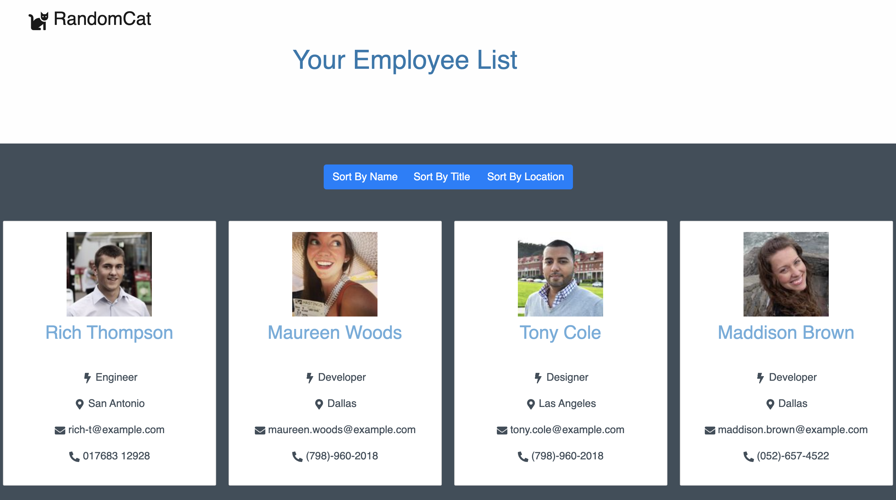

# Unit 19 React Homework: Employee Directory

An employee directory created as a with React application. Each of the application's UI into components, manage component state, and respond to user events.

[Live Application](https://ashhunt07.github.io/hw-19-react-employee-directory/)

- - -

## User Story

* As a user, I want to be able to view my entire employee directory at once so that I have quick access to their information.

- - -

## Business Context

An employee or manager would benefit greatly from being able to view non-sensitive data about other employees. It would be particularly helpful to be able to filter employees by name.

- - -

#### Contributor
##### Ashley Hunt
##### * [GitHub](https://github.com/ashhunt07)
##### * [Contact](https://ashhunt07.github.io/portfolio/contact.html)

